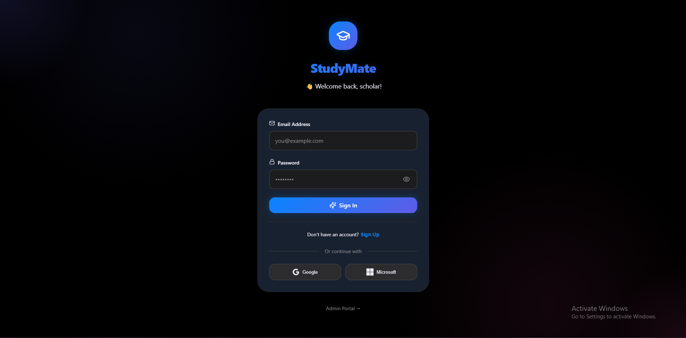
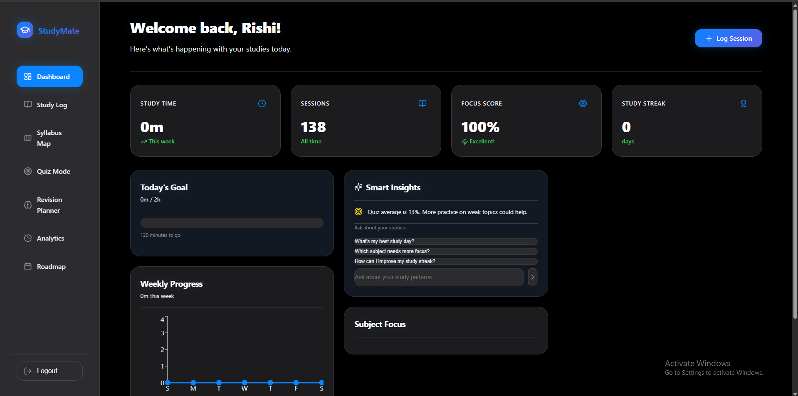
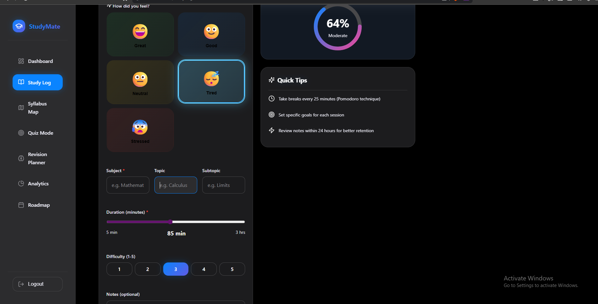
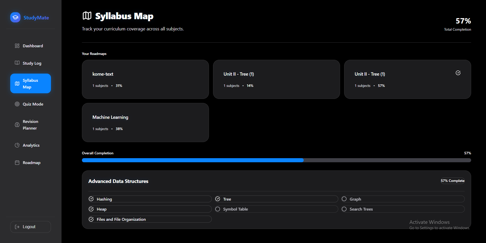
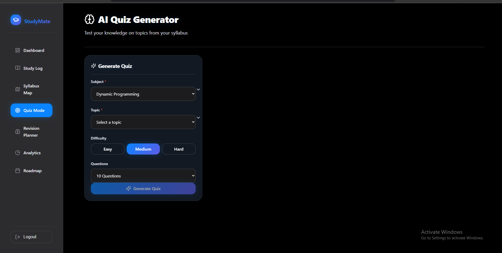
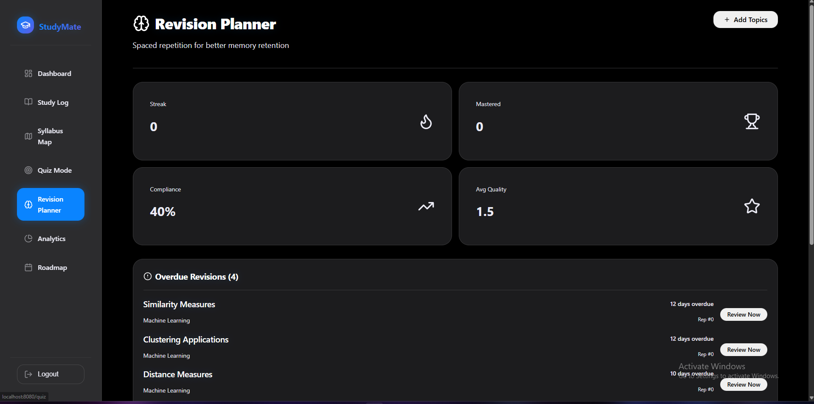
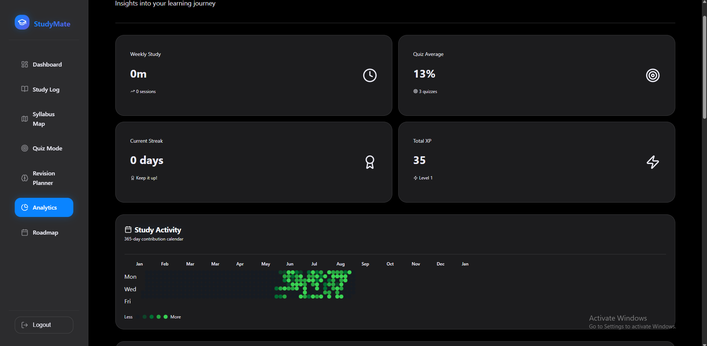
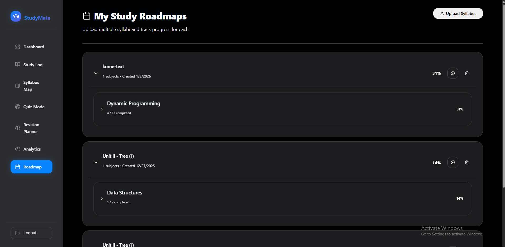

# 📚 StudyMate - Smart Study Platform

> A comprehensive MERN stack application designed to help students track their learning progress, generate AI-powered insights, and optimize their study habits.

<div align="center">


*Clean, modern authentication interface with social login options*

</div>

---

## 🌟 Features

### 📊 Intelligent Dashboard
Track your study progress at a glance with personalized insights, daily goals, and smart recommendations powered by AI.



### 📝 Study Session Logging
Record every study session with detailed metadata including subject, topic, duration, mood, and cognitive load for comprehensive analytics.



### 🗺️ Syllabus & Roadmap Tracking
Organize your curriculum across subjects and units with visual progress tracking and completion percentages.



### 🤖 AI-Powered Quiz Generator
Generate custom quizzes on any topic using local LLaMA 3.2 AI. Choose difficulty levels and question types for personalized practice.



### 🧠 Spaced Repetition System
Smart revision planner using the SM-2 algorithm to optimize memory retention with scientifically-timed review sessions.



### 📈 Advanced Analytics
GitHub-style contribution heatmap showing 365 days of study activity, weekly patterns, and subject distribution insights.



### 🎯 Learning Roadmaps
Create and manage multiple study roadmaps with progress tracking across subjects and topics.



---

## 🏗️ Tech Stack

### Frontend
- **React 18** with TypeScript
- **Vite** for blazing-fast development
- **TailwindCSS** for styling
- **shadcn/ui** components
- **Recharts** for data visualization
- **Socket.IO Client** for real-time features

### Backend
- **Node.js** with Express.js
- **MongoDB** with Mongoose ODM
- **Socket.IO** for WebSocket communication
- **JWT** for authentication
- **bcrypt** for password hashing

### AI & Machine Learning
- **Ollama** - Local LLM inference (LLama 3.2)
- **Groq API** - Cloud AI fallback
- **Vector Embeddings** - Semantic search with RAG
- **Transformers.js** - Client-side ML

---

## 🚀 Getting Started

### Prerequisites

Before running the application, ensure you have:

- **Node.js** (v18 or higher) - [Download](https://nodejs.org/)
- **MongoDB** (v6 or higher) - [Download](https://www.mongodb.com/try/download/community)
- **Ollama** (Optional, for local AI) - [Download](https://ollama.ai/)

### Installation

1. **Clone the repository**
   ```bash
   git clone https://github.com/Rishikesh103/StudyMate.git
   cd StudyMate
   ```

2. **Install dependencies**
   ```bash
   npm install
   ```

3. **Set up environment variables**
   
   Create a `.env` file in the root directory:
   ```env
   # Database
   MONGODB_URI=mongodb://127.0.0.1:27017/studymate
   
   # Authentication
   JWT_SECRET=your_secure_random_secret_here
   
   # Server
   PORT=5000
   
   # AI Configuration
   GROQ_API_KEY=your_groq_api_key_here
   OLLAMA_BASE_URL=http://localhost:11434
   OLLAMA_MODEL=llama3.2
   USE_OLLAMA=true
   ```

4. **Start MongoDB**
   
   **Windows:**
   ```powershell
   net start MongoDB
   ```
   
   **macOS/Linux:**
   ```bash
   sudo systemctl start mongod
   ```
   
   **Or run manually:**
   ```bash
   mongod --dbpath=/path/to/data/db
   ```

5. **Set up Ollama** (Optional - for local AI features)
   ```bash
   # Pull the LLama 3.2 model
   ollama pull llama3.2
   
   # Start Ollama server
   ollama serve
   ```

6. **Run the application**
   ```bash
   npm run dev
   ```
   
   This starts:
   - Backend server on `http://localhost:5000`
   - Frontend dev server on `http://localhost:8080`

7. **Access the application**
   
   Open your browser and navigate to:
   ```
   http://localhost:8080
   ```

---

## 📁 Project Structure

```
StudyMate/
├── client/                 # Frontend React application
│   ├── src/
│   │   ├── components/    # Reusable UI components
│   │   ├── pages/         # Route pages
│   │   ├── hooks/         # Custom React hooks
│   │   ├── lib/           # Utilities and helpers
│   │   └── App.tsx        # Main app component
│   └── vite.config.ts     # Vite configuration
│
├── server/                # Backend Express application
│   ├── config/           # Configuration files
│   │   └── db.js         # MongoDB connection with retry logic
│   ├── models/           # Mongoose schemas
│   │   ├── User.js
│   │   ├── StudySession.js
│   │   ├── QuizScore.js
│   │   ├── Roadmap.js
│   │   └── ...
│   ├── routes/           # API endpoints
│   │   ├── auth.js
│   │   ├── users.js
│   │   ├── analytics.js
│   │   └── ...
│   ├── middleware/       # Express middleware
│   │   └── authMiddleware.js
│   ├── utils/            # Utility functions
│   │   ├── aiInsights.js
│   │   ├── socketManager.js
│   │   └── ...
│   └── index.js          # Server entry point
│
├── screenshots/          # Application screenshots
├── .env                  # Environment variables (not tracked)
├── .gitignore           # Git ignore rules
├── package.json         # Dependencies and scripts
└── README.md            # This file
```

---

## 🎮 Key Features Explained

### 1. **Study Session Tracking**
- Log study sessions with subject, topic, and duration
- Track mood and cognitive load for each session
- Add notes and set difficulty levels
- Review session history with filtering options

### 2. **AI-Powered Insights**
- Get personalized study recommendations
- Identify weak areas needing more attention
- Receive optimal study time suggestions
- AI-generated quiz questions based on your syllabus

### 3. **Spaced Repetition System**
- Uses the proven SM-2 algorithm
- Automatically schedules review sessions
- Tracks retention quality ratings
- Prevents forgetting with scientific timing

### 4. **Analytics & Progress Tracking**
- 365-day GitHub-style heatmap
- Subject-wise study distribution
- Weekly and monthly trends
- Streak tracking and achievements

### 5. **Smart Roadmaps**
- Create custom learning paths
- Track progress across multiple subjects
- Set deadlines and priorities
- Monitor overall completion percentage

---

## 🔧 Configuration

### MongoDB Connection

The application uses a robust connection system with automatic retry logic:

- **3 retry attempts** with 2-second delays
- **Detailed error messages** for troubleshooting
- **Graceful fallback** to default localhost connection

Located in: `server/config/db.js`

### AI Configuration

**Using Local Ollama (Recommended):**
```env
USE_OLLAMA=true
OLLAMA_BASE_URL=http://localhost:11434
OLLAMA_MODEL=llama3.2
```

**Using Groq Cloud API:**
```env
USE_OLLAMA=false
GROQ_API_KEY=your_api_key_here
```

---

## 🛠️ Development

### Available Scripts

```bash
# Start both client and server in development mode
npm run dev

# Start only the backend server
npm run server

# Start only the frontend client
npm run client

# Build for production
npm run build

# Run database check
node check-db.js

# Seed sample data
node seed-rishi-data.js
```

### Database Management

**Check database status:**
```bash
node check-db.js
```

**Reset and seed analytics data:**
```bash
node reset-and-seed-analytics.js
```

---

## 🐛 Troubleshooting

### MongoDB Connection Issues

**Problem:** `ECONNREFUSED` error

**Solutions:**
1. Ensure MongoDB is running: `net start MongoDB` (Windows) or `sudo systemctl start mongod` (Linux/Mac)
2. Check MongoDB URI in `.env` file
3. Verify port 27017 is not in use

### Ollama Not Working

**Problem:** AI features not responding

**Solutions:**
1. Check if Ollama is running: `ollama serve`
2. Verify model is pulled: `ollama pull llama3.2`
3. Check `OLLAMA_BASE_URL` in `.env`

### Port Already in Use

**Problem:** Port 5000 or 8080 already occupied

**Solution:**
```bash
# Change ports in .env
PORT=5001  # Backend port
```

And update `vite.config.ts` for frontend port.

---

## 🌟 Core Functionality Highlights

### Multi-Role Support
- **Students** - Full access to study tracking, analytics, quizzes, and AI chat
- **Teachers** - Create assignments and monitor student progress
- **Parents** - View child's study statistics and provide feedback
- **Admins** - System-wide analytics and user management

### Real-Time Features (Socket.IO)
- Live study session updates
- Real-time notification system
- Instant analytics refresh
- Collaborative features support

### Security
- JWT-based authentication
- Bcrypt password hashing
- Role-based access control (RBAC)
- Secure session management
- Protected API routes

---

## 🤝 Contributing

Contributions are welcome! Please follow these steps:

1. Fork the repository
2. Create a feature branch (`git checkout -b feature/AmazingFeature`)
3. Commit your changes (`git commit -m 'Add some AmazingFeature'`)
4. Push to the branch (`git push origin feature/AmazingFeature`)
5. Open a Pull Request

---

## 📝 License

This project is licensed under the MIT License - see the [LICENSE](LICENSE) file for details.

---

## 👨‍💻 Author

**Rishikesh Shinde**
- GitHub: [@Rishikesh103](https://github.com/Rishikesh103)
- Email: rishikeshshinde103@gmail.com

---

## 🙏 Acknowledgments

- **Ollama** for local LLM inference
- **shadcn/ui** for beautiful UI components
- **MongoDB** for flexible data storage
- **Vite** for lightning-fast development experience

---

## 📊 Project Stats

- **Lines of Code:** 15,000+
- **API Endpoints:** 50+
- **Database Models:** 11
- **React Components:** 100+
- **Active Features:** 15+

---

<div align="center">

**Built with ❤️ for students, by students.**

[⬆ Back to Top](#-studymate---smart-study-platform)

</div>
